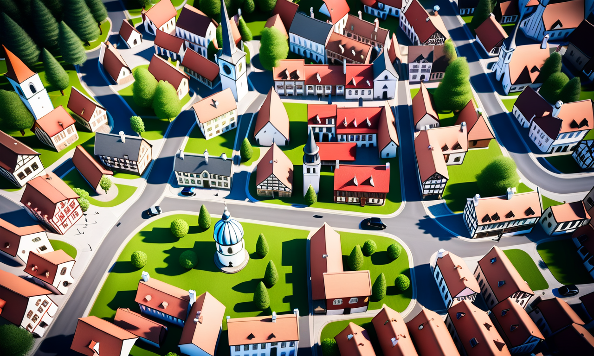
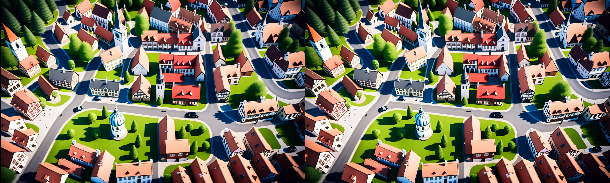
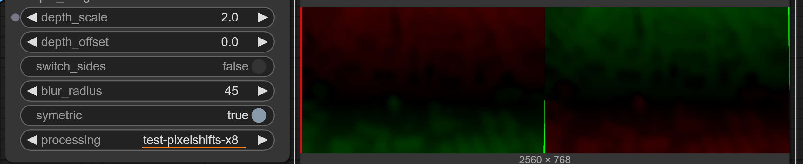

# comfyui_stereoscopic
ComfyUI Custom Nodes to create stereoscopic images and movies.

Discord: [Activation Link]([./docs/img/I2I-SBS-Workflow-Snapshot.png](https://discord.gg/ZegT6Cc8FG))

## Introduction
This package is based on the great work of Sam Seen from https://github.com/MrSamSeen/ComfyUI_SSStereoscope, that gave us a good starting point.
This package is developed by me, Fortuna, and Iablunoshka, who is responsible for the insane speed of the algorithm in the hope, that we soon see more VR content,
AI or classic.

Our development goals in this package are to improve
- processing speed
- output quality 
- ease of use

We try to use existing libraries that make use of GPU whereever possible. We improved the output quality, so it keeps useable even with extremer depth scales.
Finally we try to want to keep it easy for users by standardizing parameters and offer CLI-capable workflows to convert large-size images and long-length videos.
The execution times vary, depending on resolution and framerate, but expect not more than one minute for one second of video.

The package contains example workflows in example folder. Installation can be done over the ComfyUI Manager.

Below you will find documentation of workflow, nodes and some VR Software.

The workflows have been tested on NVIDEA Geforce 5070 Ti, GTX 1050ti, Intel UHD Graphics 630.

Sample videos can be found in the gallery under the Civitai asset page [I2I V2V Side-By-Side Converter Workflow comfyui_stereoscopic](https://civitai.com/models/1757677).

## Workflows
**PREREQUISTES:**

- For scripts the local ComfyUI_windows_portable server must be running on default port.

The included workflow depends on other custom node packages. Please install them first:
- comfyui_controlnet_aux 1.1.0
- comfyui-videohelpersuite 1.6.1
- bjornulf_custom_nodes 1.1.8
- comfyui-easy-use 1.3.1
- comfyui-custom-scripts 1.2.5
- ComfyLiterals nightly
- comfy-mtb 0.5.4

File names and path and should not contain spaces. 

The general recommendation is, to use the upscale scripts first, to ensure the video has a certain resolution, before starting the SBS Converter.
The upscale script only run on videos not greater than 1920x1080. I recommend the following parameters for Upscaler and Converter:
Sigma (Blur): 0.2
Depth Scale: 1.0
Depth Offset: 0.0

The converter limits fps to 30.0. Resolution input is automatic limited to 4K, the script can be manually called to limit resolution output as well (e.g. to upload to Civitai).

### Image-to-Image (I2I) Converter

Workflow Snapshot:


Input:
 

Output (contains workflow):


For I2I we currently offer no CLI scripts.

#### Converter Analysis

To give users an option to see what is going on and maybe to tweak things better, we provide a processing option that can be set to generate test output:


### Video-to-Video (V2V) Converter
The included workflow depends on other custom node package: comfyui_fearnworksnodes. Please install them first.

Due to memory limitation, the conversion over videos needs to be done in smaller pieces. Durations of 1 seconds with up to 24 frames may work. If not, reduce fps-rate. if this is not enough, you need to reduce resolution as well.

To simply things an [V2V Shell Script](api/v2v_sbs_converter.sh) for Git Bash is included that can be used is this way:
```
cd .../ComfyUI_windows_portable/ComfyUI
./custom_nodes/comfyui_stereoscopic/api/v2v_sbs_converter.sh 1.0 0.0 ./custom_nodes/comfyui_stereoscopic/examples/input/SmallIconicTown.mp4
```

It creates SBS video from a base video (input) and places result, with _SBS_LR appended to filename, under ComfyUI/output/sbs folder.
The end condition must be checked manually in ComfyUI Frontend (Browser). If queue is empty the concat script (path is logged) can be called. Use the batch version of the script below to handle this automatic.

Note: It uses the workflow of [V2V Template](examples/workflows/V2V_SBS_Converter.json) that has been transformed into an API callable workflow located at [V2V SBS Converter API](api/v2v_sbs_converter.py)

### Bonus Workflow: V2V Upscale with Real-ESRGAN-x4plus

To simply things an [V2V Shell Script](api/v2v_upscale.sh) for Git Bash is included that can be used is this way:
```
cd .../ComfyUI_windows_portable/ComfyUI
./custom_nodes/comfyui_stereoscopic/api/v2v_upscale.sh ./custom_nodes/comfyui_stereoscopic/examples/input/SmallIconicTown.mp4 1.0
```

It upscales a base video (input) by Real-ESRGAN-x2, for small resolutions 4plus and places result, with _x2 or _x4 appended to filename, under ComfyUI/output/upscale folder.
Videos with large resolution are just copied.
In the call above, the number at the end is optional, and is the sigma of the blur. The video must have already have a decent quality, or the model will fail.
The end condition must be checked manually in ComfyUI Frontend (Browser). If queue is empty the concat script (path is logged) can be called. Use the batch version of the script below to handle this automatic.

### Bonus Workflow: V2V Rescale
This is same as V2V Upscale with Real-ESRGAN-x2, but first it is downscaled by factor, so resolution stays same. This is intended for hires videos with bad quality.

To simply things an [V2V Shell Script](api/v2v_rescale.sh) for Git Bash is included that can be used is this way:
```
cd .../ComfyUI_windows_portable/ComfyUI
./custom_nodes/comfyui_stereoscopic/api/v2v_rescale.sh ./custom_nodes/comfyui_stereoscopic/examples/input/SmallIconicTown.mp4 1.0
```

It down-/upscales a base video (input) by Real-ESRGAN-x4plus and places result, with _x1 appended to filename,  under ComfyUI/output/upscale folder.
The number at the end is optional, and is the blur sigma. The video must have already have a decent quality, or the model will fail.
The end condition must be checked manually in ComfyUI Frontend (Browser). If queue is empty the concat script (path is logged) can be called. Use the batch version of the script below to handle this automatic.

### Mass Conversion

To convert or upscale many videos, they can be placed in ComfyUI/input/sbs_in or ComfyUI/input/upscale_in.
The end condition for batch is checked automatic, if queue gets empty the batch_concat.sh script is called.  

Don't forget to remove the input videos from the input folders afterwards.

#### Batch SBS Convert
Place videos in ComfyUI/input/sbs_in, then:

```
cd .../ComfyUI_windows_portable/ComfyUI
./custom_nodes/comfyui_stereoscopic/api/batch_sbsconverter.sh 1.0 0.0
```

Results are in ComfyUI/output/sbs

#### Batch Upscale
Place videos in ComfyUI/input/upscale_in, then:

```
cd .../ComfyUI_windows_portable/ComfyUI
./custom_nodes/comfyui_stereoscopic/api/batch_upscale.sh 1.0
```

Results are in ComfyUI/output/upscale

#### Batch Rescale
Place videos in ComfyUI/input/upscale_in, then:

```
cd .../ComfyUI_windows_portable/ComfyUI
./custom_nodes/comfyui_stereoscopic/api/batch_rescale.sh 1.0
```

Results are in ComfyUI/output/upscale

## Nodes

### Node "Convert to Side-by-Side"
This node converts an image to a side-by-side image.

#### base_image
The image you want to convert to side-by-side.

#### depth_image
The depth image corresposning to the base image. E.g.: Generate it with Depth Anything V2 from comfyui_controlnet_aux; where the resolution can be calculated with the provided helper node GetDepthResolution below.

#### depth_scale
The value of depth scale has influence on the stength of the 3D effect. It is normalized, to make it indepenend of image resolution, 1.0 is considered as normal value, 0.0 means no scale, higher values than 1.0 generate stronger effects. For a stronger 3D effect try 2.0.

### #depth_offset
The value of depth_offset is shifting to whole image to make it appear closer or farer away. The value is normalized, to make it indepenend of image resolution. 0.0 is considered as normal value producing a shift half to front, half to back. A value equal to depth_scale is all shift to front (closer to the viewer), negative values shift it all shift the back (farer away). 

#### switch_sides
Switch left/right. This might be required to be set depending on use-case and device, or if the depth image generator produces inverted images. The default is False and configured to work with Depth Anything V2.

#### blur_radius
Blur kernel size dimension. -1 turns blurring off. We set default to 45. With high depth scale and resolution you may try values up to 99.

#### symetric
If true the shift is equally devided to left and right. if false, only one image is effected. It is highly recommended to set this to true to reduce the artifacts generated by larger depth_scale values.

#### processing
Normal. Other values are for development tests and not going to be documented.


### Node "Get Resolution"
This helper node returns the resolution of the base image (minimum of width, height) to be feed into the depth image generator.

## VR Software and devices

### [Skybox VR Player](https://skybox.xyz/)
Commercial application. Supports many platforms. We have tested it on Meta Quest 3.
To simply the configuration follow their guide: [How to Adjust 2D/3D/VR Video Formats](https://skybox.xyz/support/How-to-Adjust-2D&3D&VR-Video-Formats),
e.g. by putting all videos and images under a folder with the name "fullsbs".

### [DEO VR Player](https://deovr.com/app)
Download for free. Supports many platforms. We have tested it on Meta Quest 3, HTC vive pro 2 .
To simply the configuration follow their guide: [Naming convention](https://deovr.com/app/doc#naming), e.g. by adding "_SBS_LR" to the end of the file name.

### [4XVR Video Player](https://www.4xvr.net/)
Commercial application. Auto-detection of aspect ratio currently not working (support pending). Manual setup per file required to 3D FSBS.
