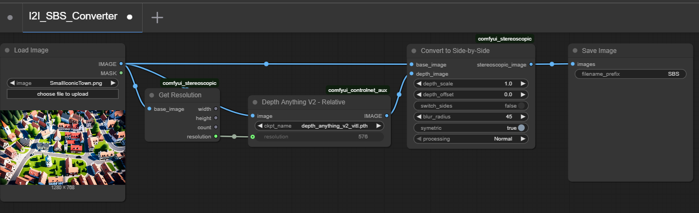

# comfyui_stereoscopic
ComfyUI Custom Nodes to create stereoscopic images and movies.

## Introduction
This package is based on the great work of Sam Seen from https://github.com/MrSamSeen/ComfyUI_SSStereoscope, that gave us a good starting point.

The target of this package is to improve
- processing speed
- output quality 
- ease of use

We try to use existing libraries that make use of GPU whereever possible. We improved the output quality, so it keeps useable even with extremer depth scales.
Finally we try to want to keep it easy for users by standardizing parameters and offer CLI-capable workflows to convert large-size images and long-length videos.

The package contains example workflows in example folder.

### I2I
Workflow Snapshot:

Input:
 

Output (contains workflow):

### V2V

## Node "Convert to Side-by-Side"
This node converts an image to a side-by-side image.

### Parameters

#### base_image
The image you want to convert to side-by-side.

#### depth_image
The depth image corresposning to the base image. E.g.: Generate it with Depth Anything V2 from comfyui_controlnet_aux; where the resolution can be calculated with the provided helper node GetDepthResolution below.

#### depth_scale
The value of depth scale has influence on the stength of the 3D effect. It is normalized, to make it indepenend of image resolution, 1.0 is considered as normal value, 0.0 means no scale, higher values than 1.0 generate stronger effects. For a stronger 3D effect try 2.0.

#### depth_offset
The value of depth_offset is shifting to whole image to make it appear closer or farer away. The value is normalized, to make it indepenend of image resolution. 0.0 is considered as normal value producing a shift half to front, half to back. A value equal to depth_scale is all shift to front (closer to the viewer), negative values shift it all shift the back (farer away). 

#### switch_sides
Switch left/right. This might be required to be set depending on use-case and device.

#### blur_radius
Blur kernel size dimension. -1 turns blurring off. We set default to 45. With high depth scale and resolution you may try values up to 99.

#### symetric
If true the shift is equally devided to left and right. if false, only one image is effected. It is highly recommended to set this to true to reduce the artifacts generated by larger depth_scale values.

#### processing
Normal. Other values are for development tests and not going to be documented.

## Node "Get Resolution"
This helper node returns the resolution of the base image (minimum of width, height) to be feed into the depth image generator.

