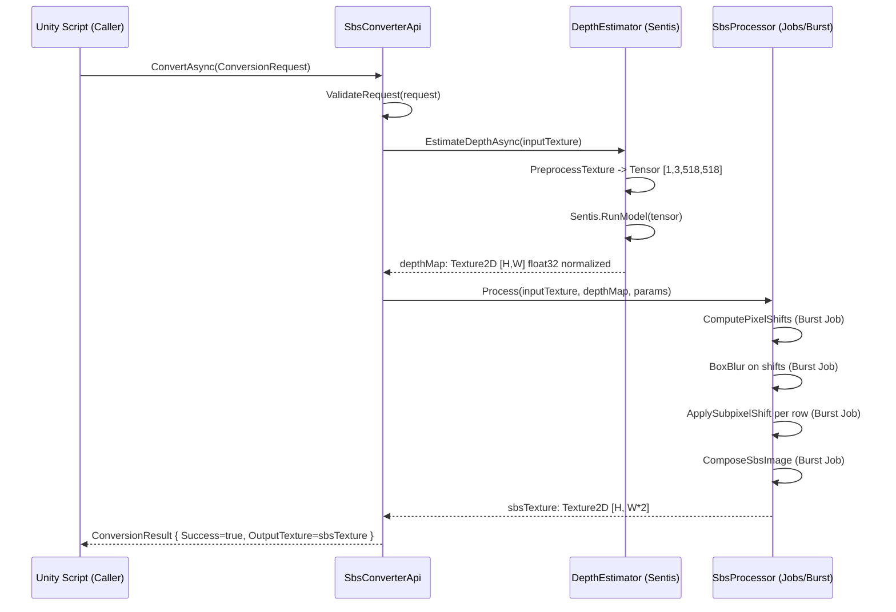

# Design Document: SBS Image Converter — Unity/Android (Pure C#)

## Overview

The entire Python system is replaced by a **pure C# Unity library** shipped as an Android APK. There is no Python runtime, no `Process.Start`, and no external process of any kind. The two core components of the Python system are ported directly to C#:

1. **Depth estimation** (`depthestimator.py`) → **Unity Sentis** runs the `Depth-Anything-V2-Small` model as an ONNX asset directly on-device (GPU Compute or CPU fallback).
2. **SBS converter** (`converter.py`) → **C# with Unity Jobs + Burst Compiler** for parallel CPU processing.

The public API remains `Texture2D`-based and is identical to the previous specification from the caller's perspective.

---

## Architecture Overview

```
┌─────────────────────────────────────────────────────────────┐
│                     Unity Android APK                        │
│                                                             │
│  ┌──────────────┐    ┌─────────────────────────────────┐   │
│  │  Unity Scene │    │     SbsConverterComponent        │   │
│  │ (MonoBehaviour)──►│  (MonoBehaviour Wrapper)         │   │
│  └──────────────┘    │                                  │   │
│                      │  IImageConverter                  │   │
│                      │       │                           │   │
│                      │  ┌────▼──────────────────────┐   │   │
│                      │  │   SbsConverterApi          │   │   │
│                      │  │  (pure C# implementation)  │   │   │
│                      │  │                            │   │   │
│                      │  │  ┌──────────────────────┐  │   │   │
│                      │  │  │  DepthEstimator       │  │   │   │
│                      │  │  │  (Unity Sentis ONNX)  │  │   │   │
│                      │  │  └──────────────────────┘  │   │   │
│                      │  │                            │   │   │
│                      │  │  ┌──────────────────────┐  │   │   │
│                      │  │  │  SbsProcessor         │  │   │   │
│                      │  │  │  (Jobs + Burst)       │  │   │   │
│                      │  │  └──────────────────────┘  │   │   │
│                      │  └────────────────────────────┘   │   │
│                      └─────────────────────────────────┘   │
│                                                             │
│  Assets/StreamingAssets/Models/                             │
│    depth_anything_v2_small.onnx   (~100 MB)                 │
└─────────────────────────────────────────────────────────────┘
```

---

## Main Workflow / Sequence Diagram



---

## Core Interfaces / Types

```csharp
/// <summary>
/// Parameters for a single conversion call.
/// Input and output are Unity Texture2D objects.
/// </summary>
public sealed record ConversionRequest
{
    /// <summary>Input texture (RGB/RGBA, any resolution).</summary>
    public required Texture2D InputTexture { get; init; }

    /// <summary>HuggingFace model ID — used to select the ONNX asset.</summary>
    public string Model { get; init; } = "depth-anything/Depth-Anything-V2-Small-hf";

    /// <summary>Scale factor for the depth map (default: 1.0).</summary>
    public float DepthScale { get; init; } = 1.0f;

    /// <summary>Offset for the depth map (default: 0.0).</summary>
    public float DepthOffset { get; init; } = 0.0f;

    /// <summary>Blur radius applied to depth shifts before warping (default: 19, must be odd >= 1).</summary>
    public int BlurRadius { get; init; } = 19;

    /// <summary>Enable symmetric rendering (both eyes shifted equally in opposite directions).</summary>
    public bool Symmetric { get; init; } = false;

    /// <summary>Swap left and right eye images in the output.</summary>
    public bool SwitchSides { get; init; } = false;
}

/// <summary>
/// Result of a conversion call.
/// No stdout/stderr strings — all diagnostics go through ILogger.
/// </summary>
public sealed record ConversionResult
{
    public bool       Success       { get; init; }
    public int        ExitCode      { get; init; }  // 0 = success, -1 = error

    /// <summary>
    /// Output SBS texture (width = 2 * input width).
    /// Null when Success is false.
    /// </summary>
    public Texture2D? OutputTexture { get; init; }
}

/// <summary>
/// Configuration for the pure-C# converter.
/// </summary>
public sealed record SbsConverterOptions
{
    /// <summary>
    /// Path to the ONNX model file, relative to Application.streamingAssetsPath.
    /// Default: "Models/depth_anything_v2_small.onnx"
    /// </summary>
    public string OnnxModelPath { get; init; } = "Models/depth_anything_v2_small.onnx";

    /// <summary>
    /// Sentis inference backend.
    /// BackendType.GPUCompute (preferred) or BackendType.CPU (fallback).
    /// </summary>
    public BackendType InferenceBackend { get; init; } = BackendType.GPUCompute;

    /// <summary>
    /// Input resolution expected by the ONNX model.
    /// Depth-Anything-V2-Small uses 518x518.
    /// </summary>
    public int ModelInputSize { get; init; } = 518;
}

/// <summary>
/// Public interface — identical to the previous specification.
/// </summary>
public interface IImageConverter
{
    Task<ConversionResult> ConvertAsync(
        ConversionRequest request,
        CancellationToken cancellationToken = default);
}
```

---

## Component 1: DepthEstimator (Unity Sentis)

### Purpose
Port of `depthestimator.py` to C# using Unity Sentis.

### Model Preparation (build-time, one-time)

The PyTorch model must be exported to ONNX once on the development machine:

```python
# native/convert_to_onnx.py  (runs on the developer machine, not on Android)
from transformers import AutoModelForDepthEstimation
import torch

model = AutoModelForDepthEstimation.from_pretrained(
    "depth-anything/Depth-Anything-V2-Small-hf"
).eval()

dummy = torch.randn(1, 3, 518, 518)
torch.onnx.export(
    model, dummy,
    "depth_anything_v2_small.onnx",
    input_names=["pixel_values"],
    output_names=["predicted_depth"],
    dynamic_axes={"pixel_values": {0: "batch"}},
    opset_version=17
)
```

The resulting `.onnx` file is placed in `Assets/StreamingAssets/Models/` and bundled with the APK.

### C# Implementation

```csharp
public sealed class DepthEstimator : IDisposable
{
    private Model?   _model;
    private IWorker? _worker;
    private readonly SbsConverterOptions     _options;
    private readonly ILogger<DepthEstimator> _logger;

    public DepthEstimator(SbsConverterOptions options, ILogger<DepthEstimator> logger) { … }

    /// <summary>
    /// Loads the ONNX model from StreamingAssets (lazy, called once).
    /// On Android, uses UnityWebRequest to read from the APK's StreamingAssets.
    /// </summary>
    public async Task LoadModelAsync()
    {
        string path = Path.Combine(Application.streamingAssetsPath, _options.OnnxModelPath);
        byte[] modelBytes = await LoadBytesAsync(path);   // UnityWebRequest on Android
        _model  = ModelLoader.Load(modelBytes);
        _worker = WorkerFactory.CreateWorker(_options.InferenceBackend, _model);
        _logger.LogInformation("Model loaded: {path}", _options.OnnxModelPath);
    }

    /// <summary>
    /// Estimates a depth map for the given input texture.
    /// Returns a normalized float32 depth map [0,1] at the same resolution as the input.
    /// </summary>
    public async Task<Texture2D> EstimateDepthAsync(Texture2D input)
    {
        // 1. Resize to ModelInputSize x ModelInputSize
        // 2. Normalize: mean=[0.485,0.456,0.406], std=[0.229,0.224,0.225]
        // 3. Build tensor [1, 3, 518, 518] (NCHW, float32)
        // 4. Run Sentis inference
        // 5. Bicubic resize output [1, H_out, W_out] -> [H_orig, W_orig]
        // 6. Min-max normalize to [0,1]
        // 7. Return as Texture2D (RFloat format)
    }

    public void Dispose() { _worker?.Dispose(); }
}
```

### Preprocessing Pipeline (equivalent to HuggingFace AutoImageProcessor)

```
Input: Texture2D (any size, RGB)

Step 1 — Resize:
  target = ModelInputSize x ModelInputSize (518x518)
  method: bilinear (Graphics.Blit with RenderTexture)

Step 2 — Normalize (ImageNet standard):
  pixel_norm[c] = (pixel[c] / 255.0 - mean[c]) / std[c]
  mean = [0.485, 0.456, 0.406]
  std  = [0.229, 0.224, 0.225]

Step 3 — Tensor layout:
  shape: [1, 3, 518, 518]  (NCHW)
  dtype: float32

Step 4 — Sentis inference:
  _worker.Execute(inputTensor)
  outputTensor = _worker.PeekOutput("predicted_depth")  // [1, H_out, W_out]

Step 5 — Postprocessing:
  squeeze -> [H_out, W_out]
  bicubic resize -> [H_orig, W_orig]
  min-max normalize: depth_norm = (depth - min) / (max - min + 1e-6)
  output: Texture2D (RFloat, H_orig x W_orig)
```

---

## Component 2: SbsProcessor (Jobs + Burst)

### Purpose
Port of `converter.py` to C# using Unity Jobs System and Burst Compiler.

### Algorithm (equivalent to `ImageSBSConverter.process`)

```
Input:
  baseImage:  Color32[] (H x W, RGB)
  depthMap:   float[]   (H x W, normalized [0,1])
  depthScale, depthOffset, blurRadius, symmetric, switchSides

Constants:
  mode        = Parallel  (left eye = right half of SBS image)
  invertDepth = true

Step 1 — Invert depth:
  depth[i] = 1.0f - depth[i]

Step 2 — Scale depth to [0,255] and center:
  depth_np[i] = depth[i] * 255.0f - 128.0f

Step 3 — Compute pixel shifts:
  depthScaleLocal  = depthScale * width * 50.0f / 1_000_000.0f
  depthOffsetLocal = depthOffset * -8.0f
  if symmetric:  depthScaleLocal /= 2;  depthOffsetLocal /= 2
  if invertDepth: depthOffsetLocal = -depthOffsetLocal
  pixelShifts[i] = depth_np[i] * depthScaleLocal + depthOffsetLocal

Step 4 — Box blur on pixelShifts (when blurRadius > 0):
  separable box blur: horizontal pass + vertical pass
  kernel size = blurRadius x blurRadius

Step 5 — Inverse monotone map + subpixel shift (per row, Burst Job):
  Equivalent to invert_map_1d_monotonic_numba + apply_subpixel_shift
  For each row y:
    u[x]        = x - pixelShifts[y, x]
    u_mono[x]   = max(u[x], u[x-1])          // cumulative monotonicity
    shifted_x[x]= interp(x, u_mono, x_coords) // linear interpolation
    shifted_x   = max.accumulate(shifted_x)
    shifted_img[y, x] = bilinear_sample(baseImage, shifted_x[x], y)

Step 6 — Compose SBS image:
  sbs[y, width:]  = baseImage[y, :]    // right half = original (Parallel mode)
  sbs[y, :width]  = shifted_img[y, :]  // left half  = warped image

Step 7 — Fill crop rectangles with black:
  cropSize = (int)(depthScale * 6) + (int)(depthOffset * 8)
  if symmetric: cropSize /= 2
  Black rectangle at the seam (prevents edge artifacts)

Step 8 — Symmetric pass (optional, second pass with negated depthScaleLocal):
  Repeat steps 3-6 for the other half

Step 9 — SwitchSides (optional):
  Swap left and right halves of the SBS image
```

### Job Structure

```csharp
// Job 1: Depth inversion + shift computation
[BurstCompile]
struct ComputeShiftsJob : IJobParallelFor
{
    [ReadOnly]  public NativeArray<float> DepthMap;
    [WriteOnly] public NativeArray<float> PixelShifts;
    public float DepthScaleLocal;
    public float DepthOffsetLocal;
    public int   Width;
    // Execute(int i): computes PixelShifts[i]
}

// Job 2: Separable box blur — horizontal pass
[BurstCompile]
struct BoxBlurHorizontalJob : IJobParallelFor { … }

// Job 3: Separable box blur — vertical pass
[BurstCompile]
struct BoxBlurVerticalJob : IJobParallelFor { … }

// Job 4: Inverse monotone map + subpixel shift (one row per job index)
[BurstCompile]
struct ApplySubpixelShiftJob : IJobParallelFor
{
    [ReadOnly]  public NativeArray<Color32> BaseImage;
    [ReadOnly]  public NativeArray<float>   PixelShifts;
    [WriteOnly] public NativeArray<Color32> SbsImage;
    public int Width, Height, FlipOffset;
    // Execute(int y): processes one row
}

// Job 5: Fill black rectangles (crop seam artifacts)
[BurstCompile]
struct FillRectJob : IJobParallelFor { … }
```

---

## Component 3: SbsConverterApi (Orchestration)

```csharp
public sealed class SbsConverterApi : IImageConverter, IDisposable
{
    private readonly DepthEstimator          _depthEstimator;
    private readonly SbsProcessor            _sbsProcessor;
    private readonly ILogger<SbsConverterApi> _logger;
    private bool _modelLoaded = false;

    public SbsConverterApi(SbsConverterOptions options, ILogger<SbsConverterApi> logger) { … }

    public async Task<ConversionResult> ConvertAsync(
        ConversionRequest request,
        CancellationToken cancellationToken = default)
    {
        ValidateRequest(request);

        if (!_modelLoaded)
        {
            await _depthEstimator.LoadModelAsync();
            _modelLoaded = true;
        }

        // Step 1: depth estimation
        Texture2D depthMap = await _depthEstimator.EstimateDepthAsync(request.InputTexture);

        // Step 2: SBS conversion
        Texture2D sbsTexture = _sbsProcessor.Process(
            request.InputTexture,
            depthMap,
            request.DepthScale,
            request.DepthOffset,
            request.BlurRadius,
            request.Symmetric,
            request.SwitchSides
        );

        _logger.LogInformation("Conversion successful: {w}x{h}",
                               sbsTexture.width, sbsTexture.height);

        return new ConversionResult
        {
            Success       = true,
            ExitCode      = 0,
            OutputTexture = sbsTexture
        };
    }

    public void Dispose() => _depthEstimator.Dispose();
}
```

---

## Component 4: SbsConverterComponent (MonoBehaviour)

Unity wrapper for use in scenes:

```csharp
public class SbsConverterComponent : MonoBehaviour
{
    [SerializeField] private SbsConverterOptions _options = new();

    private IImageConverter _converter = null!;

    private void Awake()
    {
        _converter = new SbsConverterApi(_options, /* ILogger from DI or Debug.unityLogger */);
    }

    private void OnDestroy()
    {
        (_converter as IDisposable)?.Dispose();
    }

    /// <summary>
    /// Converts a texture to a stereoscopic SBS image.
    /// Awaitable from async methods or Unity coroutines via .AsTask().
    /// </summary>
    public Task<ConversionResult> ConvertAsync(
        Texture2D input,
        float depthScale  = 1.0f,
        float depthOffset = 0.0f,
        int   blurRadius  = 19,
        bool  symmetric   = false)
    {
        return _converter.ConvertAsync(new ConversionRequest
        {
            InputTexture = input,
            DepthScale   = depthScale,
            DepthOffset  = depthOffset,
            BlurRadius   = blurRadius,
            Symmetric    = symmetric
        });
    }
}
```

---

## Project Structure

```
Assets/
├── Scripts/
│   └── SbsConverter/
│       ├── IImageConverter.cs              # Interface + record types
│       ├── SbsConverterApi.cs              # Orchestration
│       ├── SbsConverterOptions.cs          # Configuration record
│       ├── SbsConverterComponent.cs        # MonoBehaviour wrapper
│       ├── DepthEstimator/
│       │   └── DepthEstimator.cs           # Sentis ONNX inference
│       └── SbsProcessor/
│           ├── SbsProcessor.cs             # Job orchestration
│           ├── ComputeShiftsJob.cs         # Burst Job: shift computation
│           ├── BoxBlurJob.cs               # Burst Job: box blur
│           ├── ApplySubpixelShiftJob.cs    # Burst Job: subpixel warp
│           └── FillRectJob.cs              # Burst Job: crop rectangles
├── StreamingAssets/
│   └── Models/
│       └── depth_anything_v2_small.onnx   # ~100 MB, bundled with APK
└── Tests/
    └── EditMode/
        └── SbsConverter/
            ├── DepthEstimatorTests.cs
            ├── SbsProcessorTests.cs
            └── TestAssets/
                └── test_input.png          # 320x200 synthetic test image

native/
├── convert_to_onnx.py                      # One-time ONNX export script
├── build.ps1                               # Build script (ONNX export + Unity Android build)
└── test.ps1                                # Test script (Unity EditMode tests)
```

---

## Build Process (build.ps1)

```
Phase 1: ONNX export (one-time, on developer machine)
  pip install transformers torch onnx
  python native/convert_to_onnx.py
  -> output: Assets/StreamingAssets/Models/depth_anything_v2_small.onnx

Phase 2: Unity Android APK build
  Unity -batchmode -buildTarget Android -executeMethod BuildScript.BuildAndroid
  -> output: build/SbsConverter.apk

Phase 3: Run EditMode tests
  Unity -batchmode -runTests -testPlatform EditMode -testResults test-results.xml
```

---

## Error Handling

| Scenario | Behavior |
|---|---|
| `InputTexture` is null | `ValidateRequest` throws `ArgumentNullException` |
| ONNX model file not found | `LoadModelAsync` throws `FileNotFoundException`; `LogError` |
| Sentis inference fails | Exception caught; returns `ConversionResult { Success=false, ExitCode=-1 }` |
| GPU backend unavailable | Automatic fallback to `BackendType.CPU`; `LogWarning` |
| `CancellationToken` triggered | `OperationCanceledException` re-thrown |
| `NativeArray` not disposed | Caught in `finally` block; `LogWarning` |

---

## Logging

| Level | Event |
|---|---|
| `LogDebug` | Sentis inference time, Job execution time per stage |
| `LogInformation` | Model loaded, conversion successful (resolution, elapsed time) |
| `LogWarning` | GPU backend unavailable, fallback to CPU; NativeArray disposal failure |
| `LogError` | Model not found, inference failed, null input |

---

## Dependencies

| Package | Version | Purpose |
|---|---|---|
| `com.unity.sentis` | 1.4+ | ONNX model inference (Depth-Anything-V2) |
| `com.unity.burst` | 1.8+ | Burst-compiled Jobs for SBS processing |
| `com.unity.collections` | 2.x | `NativeArray` for Jobs |
| `com.unity.jobs` | 0.70+ | Unity Jobs System |
| `com.unity.mathematics` | 1.3+ | SIMD math in Burst Jobs |

No Python runtime. No `Process.Start`. No external processes.

---

## Correctness Properties

*A property is a characteristic or behavior that should hold true across all valid executions of a system — essentially, a formal statement about what the system should do. Properties serve as the bridge between human-readable specifications and machine-verifiable correctness guarantees.*

### Property 1: ConvertAsync always returns a result

For any valid `ConversionRequest` (non-null `InputTexture`), `ConvertAsync` SHALL always return a non-null `ConversionResult` and SHALL NOT throw an unhandled exception.

**Validates: Requirements 1.2, 1.4**

### Property 2: SBS output dimensions

For any successful conversion, `OutputTexture.width` SHALL equal `InputTexture.width * 2` and `OutputTexture.height` SHALL equal `InputTexture.height`.

**Validates: Requirements 1.8, 3.1 (height), 8.3, 8.4**

### Property 3: Depth map is normalized

For any input `Texture2D`, the output of `EstimateDepthAsync` SHALL contain only values in the range `[0, 1]` (every pixel value `v` satisfies `0.0f <= v <= 1.0f`).

**Validates: Requirements 2.9, 2.10, 8.1**

### Property 4: Depth map resolution matches input

For any input `Texture2D` of size `W × H`, the `Texture2D` returned by `EstimateDepthAsync` SHALL have width `W` and height `H`.

**Validates: Requirements 2.10, 8.2**

### Property 5: Symmetric flag produces mirrored shifts

For any depth map and any `ConversionRequest` with `Symmetric == true`, the pixel shifts computed for the left-eye pass and the right-eye pass SHALL be equal in magnitude and opposite in sign at every pixel position.

**Validates: Requirements 3.4, 3.12, 8.6**

### Property 6: Blur invariant

For any pixel shift map, when `BlurRadius == 0`, the blur jobs SHALL NOT be executed and the pixel shift values SHALL be identical before and after the blur step.

**Validates: Requirements 3.6, 8.5**

### Property 7: SwitchSides swaps halves

For any SBS image produced with `SwitchSides == false`, applying `SwitchSides == true` to the same input SHALL produce an image where the left half equals the original right half and the right half equals the original left half.

**Validates: Requirements 3.13, 8.7**

### Property 8: Native resources are always released

For any `ConvertAsync` call — whether it succeeds, fails with an exception, or is cancelled — all `NativeArray` instances and intermediate `RenderTexture` objects allocated during that call SHALL be disposed before the call returns or the exception propagates.

**Validates: Requirements 4.4, 4.5, 4.6, 4.7**
